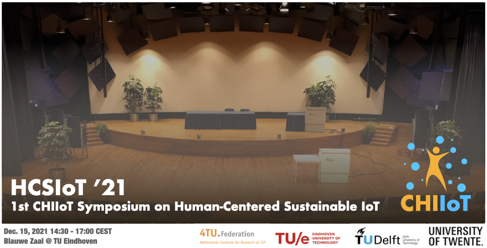

<!-- ## EWSN '21 Workshop on Computer-Human Interaction and human-centered Applications Using IoT Solutions
**Feburary 17, 2021. Delft, The Netherlands** -->

<link rel="shortcut icon" type="image/x-icon" href="icon.png">

Image via [Stockvault](https://www.stockvault.net/) (copyright-free)
## 1st CHIIoT Human-Centered Sustainable IoT Symposium (HCSIoT ‘21)
- Time: Dec. 15 14:30 - 17:00
- Location: Blauwe Zaal @ TU Eindhoven

### (Jan. 2022) Check the [Human-Centered Sustainable IoT CapStone Project Gallery](/HCSIoT/)!

### (Dec. 2021) With a heavy heart, we decided to postpone the 1st Human-Centered Sustainable IoT Symposium (HCSIoT ‘21) to the next year due to the COVID-19 measure in the Netherlends and the quarantine situation of the organization team members**

## Welcome to *HCSIoT ‘21*: 1st CHIIoT Human-Centered Sustainable IoT Symposium
This sympsium will be a live-streamed event (link TBD). We will make an uncompromised live physical demo both, which will be streamed with cameras. Live Q&A channel is possible via Discord. Physical attendance will be limited due to the corona measure. Ultimately, we will not open the hall to external guests. 

## Program (Timezone: CET)
---
### 14:30-14:35 Opening: Rong-Hao Liang, TU/e
### 14:35-14:55 Keynote Talk: Designing Shape-Changing Interfaces in IoT - Dr. Anke van Oosterhout, TU/e
### 15:00-15:10 Demo #1 - IoT Sandbox, Joep Frens, TU/e [Project page](/HCSIoT/IoTSandBox/)
### 15:15-15:25 Demo #2 - SunBox, Marco Zuniga, TU Delft [Project page](/HCSIoT/SunBox/)
### 15:30-15:40 Demo #3 - OOCSI@Home, Mathias Funk, TU/e [Project page](/HCSIoT/OOCSIatHome/)
### 15:45-15:55 Demo #4 - Battery-free prototyping platform, Przemysław Pawełczak, TU Delft [Project page](/HCSIoT/BFree/)
### 16:00-16:10 Demo #5 - IoT Communicators, Yaliang Chuang, TU/e [Project page](/HCSIoT/IoTCommunicators/)
### 16:15-16:25 Demo #6 - Multimodal smartphone-based localization, Alessandro Chiumento, UTwente 
### 16:30-17:00 Closing Remarks and Live Experience

## Goal of this *HCSIoT '21* symposium
Sustainable computing devices are a valuable solution for a city-scale deployment of the IoT, providing valuable data for industrial applications such as cyber-physical systems and digital twins where the human/user factors are crucial. We bring together researchers and practitioners from HCI design, computer science, and electrical engineering working on new challenges in industry and academia. 

Research team from TU Eindhoven, TU Delft, and UTwente will present tangible results of our collaborations on the topic "Human-Centered Sustainable IoT." The demonstrators will be focused on toolkits, educational and research artifacts to inform ICT researchers, educators, and practitioners in the 4TU.NIRICT community about cutting-edge technologies and methodologies for building user-centered sustainable IoT applications. The demonstrators will provoke discussions on the challenges and opportunities associated with emerging IoT technologies in human-centered applications. 

Our long-term goal is to bring together an international and cross-disciplinary group of researchers from academia and industry to collaborate and explore the topic. We aim at building a community in which CHI and IoT researchers can exchange views and begin fruitful collaboration.

### General Chair
**[Rong-Hao Liang](https://howieliang.github.io/)** is an Assistant Professor in  Industrial Design Department and Electrical Engineering Department, Eindhoven University of Technology. He is also the co-founder of GaussToys Inc. He is interested in technical HCI research, focusing on sensing systems and rapid prototyping tools for applications in ubiquitous computing and human-computer interaction.

## Contact Us
If you have questions or need further information, please contact us via [email](mailto:r.liang@tue.nl) with a subject "HCSIoT '21: (your question)".

## Acknowledgments
This workshop is supported by the 4TU.NIRICT community funding and TU Eindhoven.
