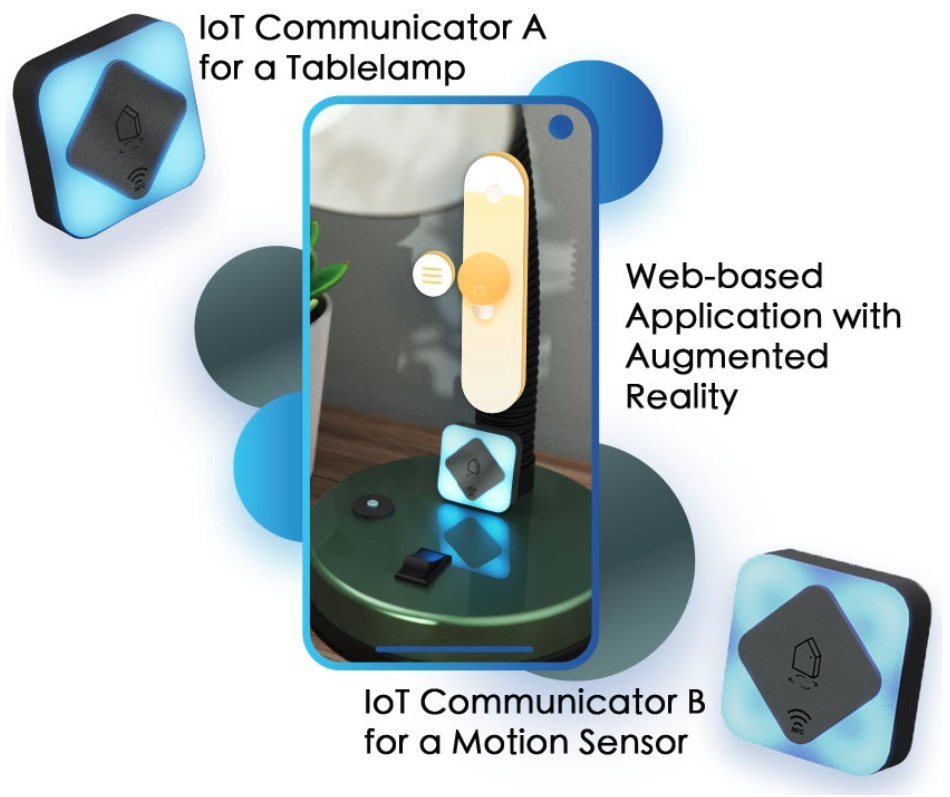
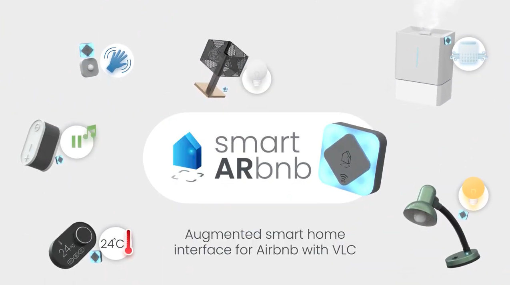

___Human-Centered Sustainable IoT Capstone Projects___

## [< Back to Gallery](/HCSIoT/)

# IoT Communicators
__PI: Yaliang Chuang, TU/e__

_Researchers:_
Yaliang Chuang (TU/e), Tomas Gecevičius (TU/e)

**IoT communicators enable smart IoT devices and systems to provide users with perceptible feedforward and feedback that can convey systems' intentions with semantic visual languages and let users feel in control of the settings without interrupting their jobs.**

## Video

## Abstract
IoT products and systems are becoming ubiquitous in many people's everyday lives. They simplify and amplify users' private and professional jobs by monitoring users' behaviors and proactively activating or switching particular settings, optimizing users' activities. In the conventional designs, those systems communicate to users with every tiny data on the digital interfaces. However, they fail to inform people through direct interaction when people encounter the devices in the physical world. Without getting the feedback and feedforward at the right time in the right place, users can't establish a good mental model to assure the system will work as they wish nor react to the unexpected situations properly without interrupting their primary tasks.  

To fulfill the communication gap, we developed a communicator component that could be incorporated in or attached to any IoT device. It consists of a low-cost lighting interface with multiple LEDs arranged in a ring form. We used the morphological method to generate variant patterns and investigated their semantic expressions by interviewing 10 participants' free interpretations of each design. As a result, we produce ten types of lighting patterns, and each could convey particular meanings, including greeting users, announcing upcoming system automation, guiding users to intervene if they don't need it, indicating the system or devices' status, etc. We believe that our IoT communicator could provide users glanceable information for assuring the system is operating as they expect. If they want to know more, they can use the AR interface to see the detailed information on digital devices. In the next step, we will conduct a usability study to investigate the interaction and user experiences with multiple devices working together in a physical environment.

## Project Page
[Link](https://gecevicius.lt/SmartARbnb-augmented-reality-smart-home-control.html)

## Related Publications
- Chuang, Y. (2020). Designing the expressivity of multiple smart things for intuitive and unobtrusive interactions. In _Proceedings of the Conference on Designing Interactive Systems_, pp. 2007-2019, New York, NY: ACM. [https://doi.org/10.1145/3357236.3395450](https://doi.org/10.1145/3357236.3395450)
- Chuang, Y. (2020). IoT Communicator: A Physical Interface for Expressing Situational Info of an IoT System. In _Companion Publication of the 2020 ACM Designing Interactive Systems Conference (DIS' 20 Companion)_. Association for Computing Machinery, New York, NY, USA, 369–372, [https://doi.org/10.1145/3393914.3397096](https://doi.org/10.1145/3393914.3397096)

## Acknowledgments
This project was partially supported by the 4TU.NIRICT community funding.
