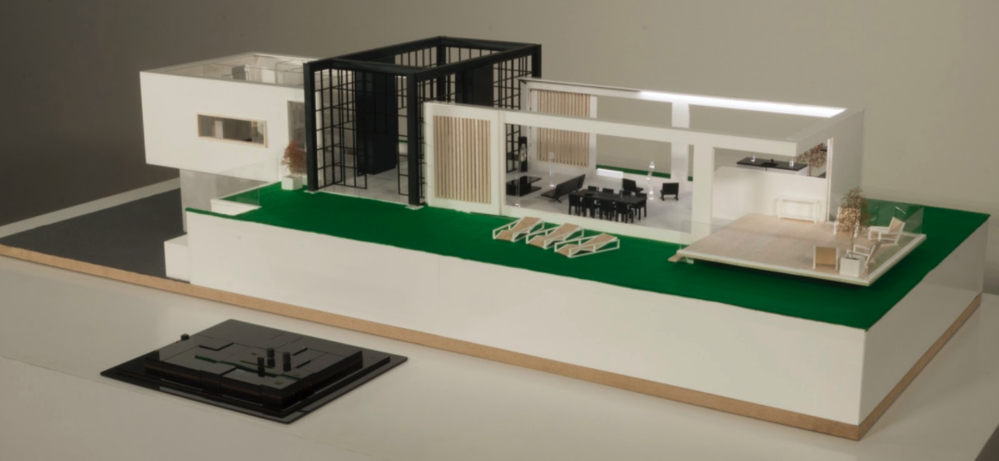
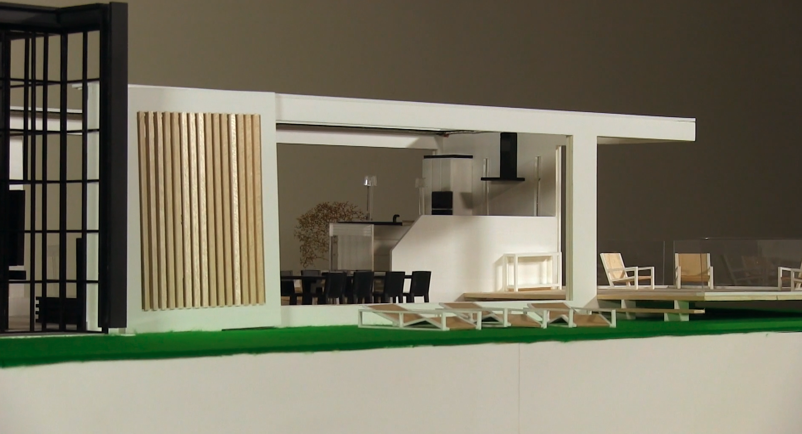

___Human-Centered Sustainable IoT Capstone Projects___

## [< Back to Gallery](/HCSIoT/)

# IoT Sandbox
__PI: Joep Frens, TU/e__

**This project shows that IoT can be approached as a dynamically growing system and demonstrates a physical, growing interface to operate it. This demonstrates that there are possibilities to rethink IoT interaction styles beyond the touchscreen.**

## Video

## Abstract
This demonstrator operates in the home environment and builds on two observations. First, we observe that IoT artifacts are very different from traditional (interactive) products in that they are designed to form IoT systems that are composed in the homes of the end user out of offerings from different manufacturers rather than bought as complete systems. Second, we observe that IoT artifacts are predominantly operated through touch screen and voice interaction. We are interested in understanding the dynamic nature of IoT systems and particularly in diversifying the interaction style of IoT artifacts beyond the touchscreen. The IoT sandbox is a research demonstrator designed to show that also physical interface can be used to control systems that are as dynamic as home IoT. The tiled interface can be adapted to control an ever-expanding set of interconnected IoT artifacts in the IoT Sandbox by adding new tiles. Next to this, pre-sets can be programmed that offer user defined functionality that can be projected in new tiles.

## Related Publications
- Frens, J., Funk, M., van Hout, B., & Le Blanc, J. (2018, June). Designing the IoT sandbox. In Proceedings of the 2018 designing interactive systems conference (pp. 341-354).

## Acknowledgments
This project was partially supported by the 4TU.NIRICT community funding.
