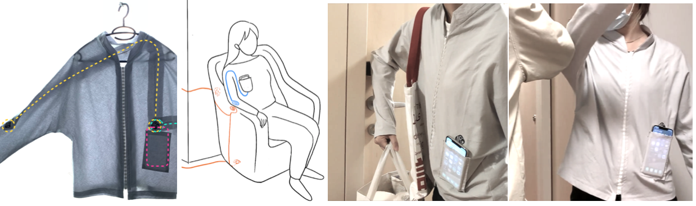

___Human-Centered Sustainable IoT Capstone Projects___

## [< Back to Gallery](/HCSIoT/)

# NFCe: Body-Centric Interaction with NFC Devices
__PI: Rong-Hao Liang, TU/e__

_Researchers:_
Huizhong Ye (TU/e), Rong-Hao Liang (TU/e)

**This project explores a sustainable way of faciliating human-centered interactions with IoT devices, smart environment, and others using passive NFC extenders worn on users' body with a smartphone.**

## Abstract
The application of interactive technology seems to be more and more inseparable from smartphones, so many times we have to take
out mobile phones to interact, such as NFC-based interaction. In this project, we proposed a body-centric interaction design space, and a design of wearable NFC relays that enable body-centric interactions for a commodity near-field communication (NFC) device. The passive extenders worn on the body can extend the operating range of the NFC reader/writer of a smartphone to the reach of the wearer’s hand, arm, or foot. These NFC devices can capture the near-field interactions between the human body and NFC-tagged objects. We explored the design space and elucidated the applications in human-computer interaction as well as IoT lifestyle. Our implementation demonstrated the proposed applications’ technical feasibility and aroused more ideas in the co-creation workshop to be generated. We also release an open-source library called OpenNFCSense, a system for detecting the movements of near-field communication (NFC) tags using a commodity, low-cost RC522 NFC reader. With a user-defined tag profile, the users can use its application programming interface (API) to obtain the NFC tagged objects’ motion speed, motion frequency, and motion type while recognizing these tagged objects. 

## Related Publications
- Huizhong Ye, NFCe: an NFC-Based Wearable System for Supporting Human-Object Interaction, Master Thesis @ TU Eindhoven, October 2021.
- Rong-Hao Liang. 2021. OpenNFCSense: Open-Source Library for NFCSense. The Adjunct Publication of the 34th Annual ACM Symposium on User Interface Software and Technology. Association for Computing Machinery, New York, NY, USA, 118–120. DOI:https://doi.org/10.1145/3474349.3480196

## Acknowledgments
This project was partially supported by the 4TU.NIRICT community funding.
