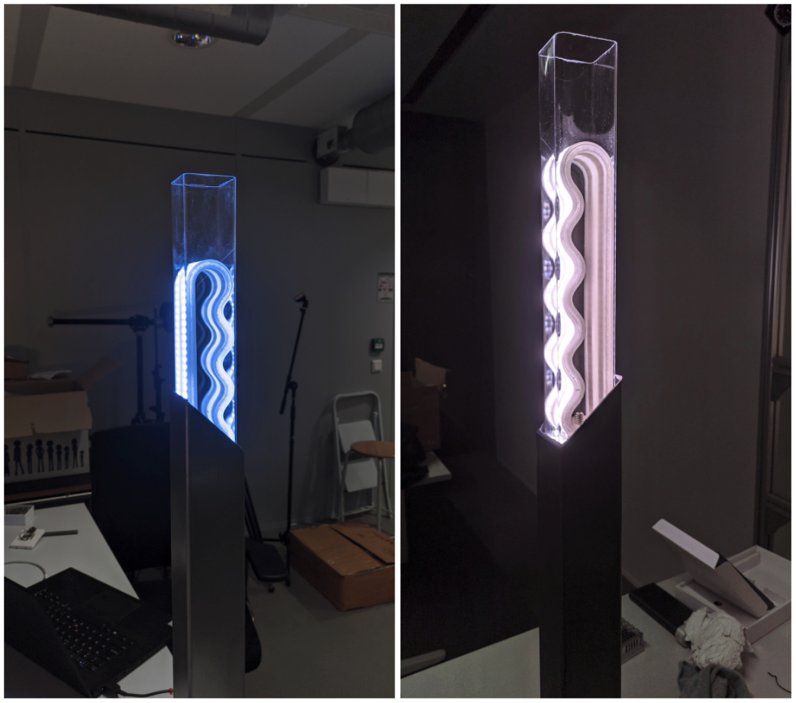

___Human-Centered Sustainable IoT Capstone Projects___

## [< Back to Gallery](/HCSIoT/)

# OOCSI@Home
__PI: Mathias Funk, TU/e__

_Researchers:_
Mathias Funk (TU/e), Diede van Marle (TU/e)

**This project integrates the OOCSI prototyping middleware with the HomeAssistant smart home automation system to enable faster, more realistic and more integrated prototyping in the smart home IoT domain.**

## Abstract
When prototyping new IoT device and interaction concepts we can make use of prototyping middleware such as OOCSI. However, integrating new connected experiences into a smart home context, often with off-the-shelf commercial IoT products, is difficult due to protocols, communication standards and complex connectivity. The OOCSI@Home project designed and developed an extension for the popular open-source HomeAssistant system which allows for an easy integration of newly designed prototypes into a smart home setup via OOCSI. As part of this integration, we also developed a protocol, heyOOCSI, to announce device types, properties and features. This protocol is transparently implemented on top of the standard OOCSI protocol and it is available on all supported platforms. This allows for controlling and integrating prototypes and other smart devices into a HomeAssistant setup. As HomeAssistant has a lot of integrations, this makes designed prototypes compatible with even more data and actuators for you to work with. For instance, one can create a new light switch for a Philips Hue bulb or use solar energy data to control a designed prototype.

## Project Page
[OOCSI_HomeAssistant](https://github.com/iddi/oocsi-HomeAssistant)
[HeyOOCSI!](https://github.com/iddi/oocsi/wiki/heyOOCSI!)

## Acknowledgments
This project was partially supported by the 4TU.NIRICT community funding.
