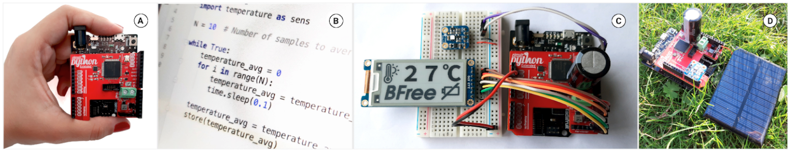

___Human-Centered Sustainable IoT Capstone Projects___

# Capstone Project 4: Battery-free prototyping platform
__PI: Przemysław Pawełczak, TU Delft__

_Researchers_
Vito Kortbeek (TU Delft), Abu Bakar (Northwestern University, USA), Stefany Cruz (Northwestern University, USA), Kasim Sinan Yildirim (University of Trento, Italy), Przemysław Pawełczak (TU Delft), Josiah Hester (Northwestern University, USA)

**The battery-free (BFree) prototyping platform allows unskilled electronic hobbyists to prototype, in easy-accessible Python programming language, systems that are battery-free while harvesting energy from the ambient sources.**

## Video

## Abstract
BFree is a hardware-software system enabling intermittent computing applications (i.e. computing that is accurate and makes progress despite power interrupts) for Adafruit Metro M0 [https://www.adafruit.com/product/3505](https://www.adafruit.com/product/3505) hobbyist-grade embedded platform that is (a) battery-free (i.e. energy is stored in a less-polluting and better maintainable capacitor, instead of a battery) and (b) powered from renewable energy sources. Power interrupts are the result of insatiable energy coming from energy harvesting sources, such as vibrations or solar power. Programs for such intermittency-protected Adafruit Metro M0 boards are written in a regular CircuitPython language. This means that the end user does not need to learn any domain-specific programming language. BFree (in the background) takes care of saving intermediate program state to a non-volatile memory of the BFree shield (i.e. red PCB shown in the photo above) and restores the program state (when the harvested power is again available) from the last moment the system lost power from insufficient harvested energy.

## Related Publications
- Vito Kortbeek, Abu Bakar, Stefany Cruz, Kasim Sinan Yildirim, Przemysław Pawełczak, Josiah Hester, BFree: Enabling Battery-Free Sensor Prototyping with Python, Proceedings of the ACM on Interactive, Mobile, Wearable and Ubiquitous Technologies, Volume 4, Issue 4, December 2020 and Proceedings of ACM UbiComp 2021

### Press Release:
-[Hackaday.com](https://hackaday.com/2021/09/29/bfree-brings-intermittent-computing-to-python/)
-[Ad.nl](https://www.ad.nl/tech/wordt-de-batterij-in-smartphone-straks-vervangen-voor-een-sensor-op-zonne-energie~a9e51182)
-[Tweakers.net](https://tweakers.net/nieuws/187196/onderzoekers-tu-delft-ontwikkelen-batterijloos-makersplatform-bfree.html)

