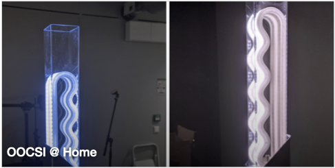

**Sustainable computing devices are a valuable solution for a city-scale deployment of the IoT, providing valuable data for industrial applications where the human/user factors are crucial. With the support from 4TU.NIRICT, we developed several demonstrators, including toolkits, educational and research artifacts using cutting-edge technologies and methodologies for building user-centered sustainable IoT applications.**

## Acknowledgments
This project was partially supported by the 4TU.NIRICT community funding.

