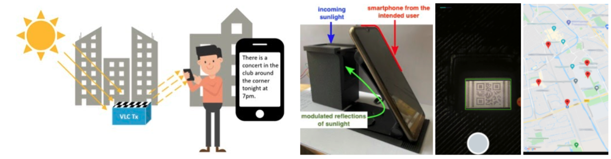

___Human-Centered Sustainable IoT Capstone Projects___

## [< Back to Gallery](/HCSIoT/)

# SunBox
__PI: Marco Zuniga, TU Delft__

_Researchers:_
Miguel Tapia (TU Delft), Talia Xu (TU Delft), Zehang Wu (TU Delft), Marco Zuniga (TU Delft)

**Sunbox uses a natural source of energy (sunlight) to communicate wirelessly.**

## Abstract
A recent development in wireless communication is the use of optical shutters and smartphone cameras to create optical links solely from ambient light. At the transmitter, a liquid crystal display (LCD) modulates ambient light by changing its level of transparency. At the receiver, a smartphone camera decodes the optical pattern. This LCD-to-camera link requires low-power levels at the transmitter, and it is easy to deploy because it does not require modifying the existing lighting infrastructure. The system, however, provides a low data rate, of just a few tens of bps. This occurs because the LCDs used in the state-of-the-art are slow single-pixel transmitters. To overcome this limitation, we introduce a novel multi-pixel display. Our display is similar to a simple screen, but instead of using embedded LEDs to radiate information, it uses only the surrounding ambient light. We build a prototype, called SunBox, and evaluate it indoors and outdoors with both artificial and natural ambient light. Our results show that SunBox can achieve a throughput between 2 kbps and 10 kbps using a low-end smartphone camera with just 30 FPS. To the best of our knowledge, this is the first screen-to-camera system that works solely with ambient light.

## Related Publications
- Miguel Chavez, Talia Xu, Zehang Wu, Marco Zuniga, SunBox: Screen-to-Camera Communication with Ambient Light, Proceedings of the ACM on Interactive, Mobile, Wearable and Ubiquitous Technologies (Accepted with revisions, to be presented at ACM Ubicomp 2022).
- Zehang Wu, Designing an optical link between a micro-display and a smartphone camera, Master Thesis @ TU Delft, November 2021.

## Acknowledgments
This project was partially supported by the 4TU.NIRICT community funding.
