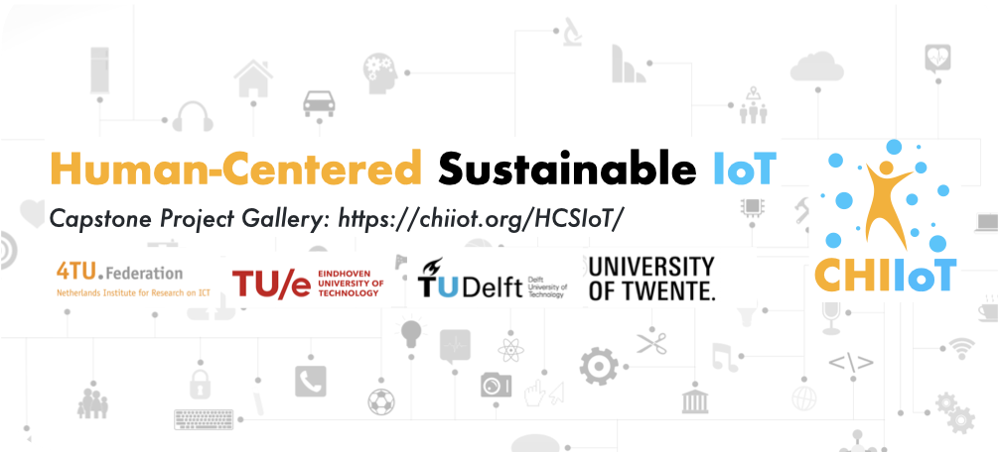

<!-- ## EWSN '21 Workshop on Computer-Human Interaction and human-centered Applications Using IoT Solutions
**Feburary 17, 2021. Delft, The Netherlands** -->

<link rel="shortcut icon" type="image/x-icon" href="icon.png">

<!--  -->

Image via [Stockvault](https://www.stockvault.net/) (copyright-free)

**With the support from 4TU.NIRICT, CHIIoT Group brings together researchers and practitioners from HCI design and IoT system engineering working on new challenges in industry and academia to jointly develop a design space and identify opportunities for future research.**

### (Jan 2021) Check our [Human-Centered Sustainable IoT CapStone Project Gallery](/HCSIoT/)!

### (Dec 2021) The [1st CHIIoT Human-Centered Sustainable IoT Symposium (HCSIoT '21)](/HCSIoT/2021/) is postponed due to the COVID-19 measure in the Netherlends.

### (Nov 2021) CHIIoT 2021 Workshops 1&2 Proceedings are Now <a href="http://ceur-ws.org/Vol-2996/">Available</a> at CEUR!

### (Nov 2021) The website of [1st CHIIoT Human-Centered Sustainable IoT Symposium (HCSIoT '21)](/HCSIoT/2021/) is online, six capstone projects about Human-Centered Sustainable IoT will be presented as live demos!

---

## Previous Events

### **The 2nd CHIIoT workshop (CHIIoT 2) will be held on Jun. 8, 2pm - 5pm (CET).** The registration is FREE for all participants of the **[ACM EICS 2021 conference](https://eics.acm.org/eics2021/)**. Both CHIIoT 2 and the EICS 2021 conference will be held fully online, and more registration details can be found via the **[Link](https://web.cvent.com/event/5d2295b4-c3bc-4fc2-9faf-e75520150095/summary)**

In CHIIoT 2, we will use *Discord* with the *Zoom Webinar* for online, face-to-face discussions. Discord provides a face-to-face experience during the coffee break and interactive poster presentations and a live texting channel for online and off-line discussions.

## Program (Timezone: CET)

### 1:30-2:00 Registration @ Discord
### 2:00-2:05 Opening @ Zoom
### 2:05-2:45 Session 1: CHIIoT Perspective Talks @ Zoom
**[CHI Perspective] Challenge and Opportunities of Repurposing Commodity RFID Tags for HCI**
- Rong-Hao Liang (TU Eindhoven)

**[IoT Perspective] Human Interaction with Battery-Free Devices**
- Przemysław Pawełczak (TU Delft)

### 2:45-3:00 B.Y.O.Coffee Break 1 @ Discord

### 3:00-4:20 Session 2: CHIIoT 2 Papers @ Zoom
**JoyTilt: Between Autonomy and Control of a Robot Vacuum Cleaner**
- Jura Miniotaite (KTH Royal Institute of Technology and Interaction Design, Sweden), Vaida Pakulyte (Electrolux, Sweden) and Ylva Fernaeus (KTH Royal Institute of Technology and Interaction Design, Sweden)
 
**Designing Wearable NFC Relays to Enable Body-Centric Interactions for a Smartphone**
- Huizhong Ye (TU Eindhoven, Netherlands), Chi-Jung Lee (National Taiwan University, Taiwan), Te-Yen Wu (Dartmouth College, USA), Xing-Dong Yang (Dartmouth College, USA), Bing-Yu Chen (National Taiwan University, Taiwan) and Rong-Hao Liang (TU Eindhoven, Netherlands)
 
**Designing Micro-intelligences for Situated Affective Computing**
- Peter Lovei (Philips and TU Eindhoven, Netherlands), Iryna Nazarchuk (TU Eindhoven, Netherlands), Suhaib Aslam (Philips, Netherlands), Bin Yu (Philips, Netherlands), Carl Megens (Philips, Netherlands) and Natalia Sidorova (TU Eindhoven, Netherlands)

**Smart ARbnb: Smart home interface for Airbnb with augmented reality and visible light communication**
- Tomas Gecevičius (TU Eindhoven, Netherlands), Yaliang Chuang (TU Eindhoven, Netherlands) and Jingrui An (TU Eindhoven, Netherlands)

### 4:20-4:30 B.Y.O.Coffee Break 2 @ Discord

### 4:30-4:55 Panel Discussion: Designing for CHI x Engineering for IoT @ Zoom
- CHIIoT Team and All Participants

### 4:50-5:00 Closing (5 min)

## Welcome to *CHIIoT 2*: 2nd Workshop on Computer Human Interaction in IoT Applications

The *CHIIoT* workshop series bring together researchers and practitioners from HCI design, computer science, and electrical engineering working on new challenges in industry and academia. The workshop will provide a platform for participants to review and discuss challenges and opportunities in the intersection of computer-human interaction and the internet of things, focusing on human-centered applications using emerging connectivity and sensing technologies. We aim to jointly develop a design space and identify opportunities for future research. 

The second workshop (__CHIIoT 2__) will be co-located with **[EICS 2021](https://eics.acm.org/eics2021/)**: The 13th ACM SIGCHI Engineering Interactive Computing Systems (EICS) conference.

__Check The Previous [CHIIoT 1](CHIIoT1/) Workshop__ & 
__Follow Our Recent Activities via The [CHIIoT Facebook Page](https://www.facebook.com/CHIIoTgroup)__.

## Position Paper Submission Deadline: May 12, 2021 (AoE) (Abstract Deadline: May 5, 2021 (AOE))
We invite 2-6 pages position paper submissions using the ACM [Two-column SIGCHI Master template](https://www.acm.org/publications/proceedings-template) The submission doesnot have to be anonymized. This position paper should address one or more of the workshop’s topics of interest or suggest another (we encourage visionary and provocative ideas). All submissions will be reviewed by the technical program committee. Paper accompanying demos are encouraged, and will be allocated time in the workshop agenda. Participants will be selected on the basis of the quality of their position paper and on the basis of background and perspective. Multimedia files should be attached as an link in the footnote.

At least one author of each accepted paper must register for the workshop and for one day of the conference itself. Participants will be invited to present a position statement at the workshop and will actively engage in a discourse on the meaningful design space for researching computer-human interaction and human-centered applications in Internet of Things. The presenting author will receive a discount for the registration.

All materials must be submitted electronically to 
**[EasyChair System](https://easychair.org/conferences/?conf=chiiot2)** by the deadline.

### FAQ 1: Could we resubmit or feature the work that has been or will be submitted to other venues?##
**Yes.** CHIIoT workshops are forums for cross-displinary discussion, so Prior/In-Press publications are *allowed and encouraged* to be included in your position papers. Later you can *opt-out* of the public release on our website so it will not introduce any trouble to your under-reviewing, accepted, or future submissions. Nonetheless, please note that your position papers will be shared among all the registered workshop participants. All Camera-Ready papers will be made available for the workshop attendee through a password-protected download link.

### FAQ 2: Could we publish archival papers in CHIIoT? ##
**Yes.** CHIIoT 2 will published the our own proceedings with [CEUR-WS](http://ceur-ws.org/) together with papers accepted in CHIIoT 1, so that your position paper will be indexed in Scopus, Google Scholar, and likely DBLP [Ref](http://ceur-ws.org/HOWTOSUBMIT.html). Also, the references will count into the citation statistics of these platforms, gaining your research visibility to the researchers cited by you. Your paper will be open-access and hosted by the CEUR-WS.org under the Creative Commons License Attribution 4.0 International (CC BY 4.0). We will ask for your permission release for this option.  

## Attending CHIIoT 2
In CHIIoT 2, we will use *Discord* with the *Zoom Webinar* for online discussions and face-to-face meetings. Discord provides a face-to-face experience during the coffee break and interactive poster presentations and a live texting channel for online and off-line discussions.

## Call for Participation
We invite position papers for the **2nd Workshop on Computer Human Interaction in IoT Applications (CHIIoT 2)**. This half-day workshop will offer a cross-disciplinary forum of discussion and knowledge exchange for researchers in the both fields. This workshop looking at the intersection of IoT and CHI, where IoT platforms focusing on human-centered applications and CHI studies using IoT solutions to build interactive environments.  

Topics of interest include but are not limited to: 
- Emotion recognition and affective computing in IoT 
- Edge computing for IoT and Cognitive IoT
- Tools and platforms for prototyping Human-IoT experiences
- Battery-less, wireless, self-sustained sensors and platforms
- Embedded AI for CHI-IoT applications  
- Sensing and monitoring applications with LP-WAN technologies  
- Human-IoT systems communication
- Visible light systems for sensing and communication
- Novel user interface technology for Human-IoT interaction
- Remote sensing solutions based on LiDAR, mmWave, or acoustic sensors  
- Human Factors in Human-IoT systems  
- 5G and Beyond-5G studies for indoor and city scenarios 

Researchers from both Computer-Human Interaction and IoT Systems are invited to submit a 2-6 pages position paper using the ACM [Two-column SIGCHI Master template](https://www.acm.org/publications/proceedings-template). The submission doesnot have to be anonymized. This position paper should address one or more of the workshop’s topics of interest or suggest another (we encourage visionary and provocative ideas). All submissions will be reviewed by the technical program committee. Paper accompanying demos are encouraged, and will be allocated time in the workshop agenda. Participants will be selected on the basis of the quality of their position paper and on the basis of background and perspective. Multimedia files should be attached as an link in the footnote.

At least one author of each accepted paper must register for the workshop and for one day of the conference itself. Participants will be invited to present a position statement at the workshop and will actively engage in a discourse on the meaningful design space for researching computer-human interaction and human-centered applications in Internet of Things.

**Submission Platform**	

All materials must be submitted electronically to 
**[EasyChair System](https://easychair.org/conferences/?conf=chiiot2)** by the deadline.

**Important Dates**
- Abstract deadlines for position papers: ~~April 28, 2021 (AoE)~~ May 5, 2021 (AoE)
- Submission deadline for position papers: ~~May 5, 2021 (AoE)~~ May 12, 2021 (AoE)
- Notification of acceptance: ~~May 12, 2021 (AoE)~~ May 19, 2021 (AoE)
- Camera ready deadline: ~~May 19, 2021 (AoE)~~ May 26, 2021 (AoE)
- Workshop date: Jun 8, 2021 (AoE)

## Organizers
The organising team combines expertise and interests from Computer-Human Interaction, Electrical Engineering and Computer Science. 

### General Co-Chairs

**[Rong-Hao Liang](https://ronghaoliang.page/)** is an Assistant Professor in Industrial Design Department and Electrical Engineering Department, Eindhoven University of Technology. He is also the co-founder of GaussToys Inc. He is interested in technical HCI research, focusing on sensing systems and rapid prototyping tools for applications in ubiquitous computing and human-computer interaction.

**[Przemysław Pawełczak](http://www.pawelczak.net/)** is an Assistant Professor with the Embedded and Networked Systems Group, Delft University of Technology, The Netherlands. He received the MSc degree from the Wroc{\l}aw University of Technology, Poland, in 2004 and the PhD degree from the Delft University of Technology, The Netherlands, in 2009. His research interests include wireless networking and intermittently-powered devices.

 

### Technical Program Committee Co-Chair

**[Joep Frens](https://www.tue.nl/en/research/researchers/joep-frens/)** is an Assistant Professor in Industrial Design Department, Eindhoven University of Technology. He leads the Connecting Rich Interaction in Growing Systems (CRIGS) squad in TU Eindhoven. Frens is interested in the research question ‘How can we design for rich interaction in growing systems?’, which he explores in a hands-on, making approach together with his students. 

**[Marco Zuniga](http://www.st.ewi.tudelft.nl/marco/)** is an Associate Professor in Computer Science Department, Delft University of Technology. His research interests are broadly in the areas of the Internet of Things (IoT), visible light communication, pervasive computing, wireless networks and cyber physical systems (CPS). He is particularly interested in research problems that are amenable to both, simple mathematical analysis and system evaluation.

### Publication Chair

**[Mathias Funk](https://www.mathias-funk.com/)** is an Associate Professor in Industrial Design Department, Eindhoven University of Technology. He leads the Things Ecology lab. In addition, he is the co-founder of UXsuite GmbH, a high-tech spin-off of Eindhoven University of Technology (TU/e). He is interested in design theory and processes for systems, designing systems for musical expression, and designing with data.  

### Publicity Chair

**[Alessandro Chiumento](https://people.utwente.nl/a.chiumento)** is an Assistant Professor in Computer Science in the Pervasive Systems research group at the University of Twente. His work is focused on the interaction between distributed dynamical systems and their environment, this includes the interplay between edge computing, sensing and machine learning for controlling IoT networks. 

### Local Co-Chairs

**[Yaliang Chuang](https://www.tue.nl/en/research/researchers/yaliang-chuang/)** is an Assistant Professor in Industrial Design Department, Eindhoven University of Technology. His research focuses on exploring the applications and user experience of connected products or systems, such as Smart Home, utilizing LED light patterns and sounds for expressing easy-to-understand semantic meanings to facilitate natural and seamless interactions.   

**[Zengrong Guo](https://research.tue.nl/en/persons/zengrong-guo)** is an Postdoc Researcher in Industrial Design Department, Eindhoven University of Technology. 

## Contact Us
If you have questions or need further information, please contact us via [email:chiiot2@easychair.org](mailto:chiiot2@easychair.org) with a subject "CHIIoT 2: (your question)".

## Acknowledgments
This workshop is supported by the 4TU.NIRICT community funding.

