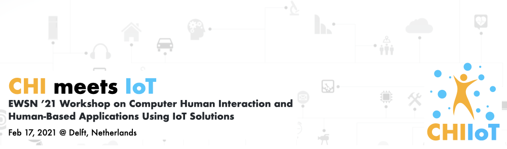

## EWSN '21 Workshop on Computer-Human Interaction and Human-Based Applications Using IoT Solutions
**Feburary 17, 2021. Delft, The Netherlands**

## Welcome to *CHI Meets IoT*!
The *CHI Meets IoT* workshop brings together researchers and practitioners from industrial design, computer science, and electrical engineering working on new challenges in industry and academia. The workshop will provide a platform for participants to review and discuss challenges and opportunities in the intersection of computer-human interaction and the internet of things, focusing on human-based applications using emerging connectivity and sensing technologies. We aim to jointly develop a design space and identify opportunities for future research. This workshop will be co-located with [EWSN 2021](https://ewsn2021.ewi.tudelft.nl/) Conference.

## Goal of *CHI Meets IoT*
We will discuss the challenges and opportunities associated with emerging IoT technologies in human-based applications. It will bring together an international and cross-disciplinary group of researchers from academia and industry to collaborate and explore the topic. We aim at building a community in which CHI and IoT researchers can exchange views and begin fruitful collaboration.

## Call for Participation
We invite position papers for the EWSN 2021 Workshop on Computer-Human Interaction Meets Internet of Things (CHI Meets IoT). This half-day workshop will offer a cross-disciplinary forum of discussion and knowledge exchange for researchers in the both fields. This workshop looking at the intersection of IoT and CHI, where IoT platforms focusing on human-based applications and CHI studies using IoT solutions to build interactive environments.  

Topics of interest include but are not limited to: 
- Emotion recognition and affective computing in IoT 
- Edge computing for IoT and Cognitive IoT
- Tools and platforms for prototyping Human-IoT experiences
- Battery-less, wireless, self-sustained sensors and platforms
- Embedded AI for CHI-IoT applications  
- Sensing and monitoring applications with LP-WAN technologies  
- Human-IoT systems communication
- Visible light systems for sensing and communication
- Novel user interface technology for Human-IoT interaction
- Remote sensing solutions based on LiDAR, mmWave, or acoustic sensors  
- Human Factors in Human-IoT systems  
- 5G and Beyond-5G studies for indoor and city scenarios 

Researchers from both Computer-Human Interaction and IoT Systems are invited to submit a position paper. This position paper should address one or more of the workshop’s topic of interests or suggest another (we encourage vision and provocation). All submissions will be reviewed by the workshop organizers. Paper accompanying demos are encouraged, and will be allocated time in the workshop agenda. Participants will be selected on the basis of the quality of their position paper and on the basis of background and perspective.  

At least one author of each accepted paper must register for the workshop and for one day of the conference itself. Participants will be invited to present a position statement at the workshop and will actively engage in a discourse on the meaningful design space for researching computer-human interaction and human-based applications in Internet of Things.

**Important Dates**
- Abstract deadlines for position papers: December 23th, 2020
- Submission deadline for position papers: January 6th, 2020 
- Notification of acceptance: January 13th, 2021

## Attending CHI Meets IoT
The workshop will be held on Feb. 17 as a half-day of full-day event, depending on the total number of papers received.\
The registration website will be announced later.
**COVID19 Mitigation:** The organization team is monitoring closely the COVID19 situation. Remote presentations will be allowed. 
Depending on how things develop, the workshop will be held fully online or in a hybrid manner.

Rong-Hao Liang (TU Eindhoven),  (University of Twente),  (TU Delft),  (TU Delft), [Mathias Funk](https://www.mathias-funk.com/) (TU Eindhoven), and [Yaliang Chuang](https://www.tue.nl/en/research/researchers/yaliang-chuang/) (TU Eindhoven).

## Organizers
The organising team combines expertise and interests from Computer-Human Interaction, Electrical Engineering and Computer Science. 

**[Rong-Hao Liang](https://howieliang.github.io/)** is Assistant Professor in Industrial Design Department and Electrical Engineering Department, Eindhoven University of Technology. He is also the co-founder of GaussToys Inc. He has an interest in technical human-computer interaction research, with a specific focus on innovative tangible and wearable sensors and rapid prototyping tools in the ubiquitous computing context.

**[Alessandro Chiumento](https://people.utwente.nl/a.chiumento)** is Assistant Professor in Computer Science in the Pervasive Systems research group at the University of Twente. His work is focused on the interaction between distributed dynamical systems and their environment, this includes the interplay between edge computing, sensing and machine learning for controlling IoT networks. 

**[Marco Zuniga](http://www.st.ewi.tudelft.nl/marco/)** is Associate Professor in Computer Science Department, Delft University of Technology. His research interests are broadly in the areas of the Internet of Things (IoT), visible light communication, pervasive computing, wireless networks and cyber physical systems (CPS). He is particularly interested in research problems that are amenable to both, simple mathematical analysis and system evaluation.

**[Przemysław Pawełczak](http://www.pawelczak.net/)** received the MSc degree from the Wrocław University of Technology, Poland, in 2004 and the PhD degree from the Delft University of Technology, The Netherlands, in 2009. Since 2013, he is employed as assistant professor with the Embedded and Networked Systems Group, Delft University of Technology, The Netherlands. His research interests include wireless networking and intermittently-powered devices.

**[Mathias Funk](https://www.mathias-funk.com/)** is Associate Professor in Industrial Design Department, Eindhoven University of Technology. He leads the Things Ecology lab. In addition, he is the co-founder of UXsuite GmbH, a high-tech spin-off of Eindhoven University of Technology (TU/e). He is interested in design theory and processes for systems, designing systems for musical expression, and designing with data.  

**[Yaliang Chuang](https://www.tue.nl/en/research/researchers/yaliang-chuang/)** is Assistant Professor in Industrial Design Department, Eindhoven University of Technology. His research focuses on exploring the applications and user experience of connected products or systems, such as Smart Home, utilizing LED light patterns and sounds for expressing easy-to-understand semantic meanings to facilitate natural and seamless interactions. 

## Contact Us
If you have questions or need further information, please contact us via [email](mailto:r.liang@tue.nl) with a subject "CHIxIOT '21: (your question)".

## Acknowledgments
This workshop is supported by the 4TU.NIRICT community funding.

 
![TUe Logo](data:image/png;base64,iVBORw0KGgoAAAANSUhEUgAAAS0AAACnCAMAAABzYfrWAAAAkFBMVEX////KEBrIAADIAATdfH/JAADJABHFAADptLXdgoX55+jSS1D++/v99/j46enJAA7turvMHyb12tvOMDbkn6HNKjDQMzvz09ThjI/npafjlJfyzc7tw8TZa27rvb7nrK7XXWLcdXn88fLQPULMHibSRUrXYWXdf4Lcd3rLFR/WXmLkmpzYZmrVV1vgiYvRQEYrl53xAAANQklEQVR4nO2ca3uiPBCGYZAEAY3i+VzRbrUe9v//u3cmCQcRq+1ut+31zvNhVQgh3CSTyUy6jsNisVgsFovFYrFYLBaLxWKxWCwWi8VisVgsFovFYrFYLBaLxWKxWCwWi8VisVgsFovFYrFYLNbXKrBafnVDfoISCVpy+tUt+Qlae64WpF/dkh+gFhhY3uKrW/JBTXaNR7SbU+FpcWB93Tvidel0/c0sLTl6VxttxeuZ45zHK2rzroOH22tqVf+AWiW64Hy3pi/heq1vMFoPB70GXuXgA8R05NxYx3P7xC1ntm5oi9DcHR5syRG8RyT7VPi5KCzDq6paMj8LsvZmA6Fhid67YDmxb4zdxHEkHB1ngT9aSEtKfMqBsYRb4teXktiMpKRZZGeNJL65HUh63aGEyJlITx9OnZX0qHzswunBliyU+4hA04pEcaCOVql83b1GtmvB5J20PBG9YPfAJwMaxAvPJQSppFYNxX5x/A2C3ucEgGglAEhrDS4sDg0QcHZm+jo6v8R/vPWL7lsrMC9uA0/fkNZHbXzsQTZUMloCO4WlpYZ4fO672N3KtEKERf0pES4kTk8I7I3Pyo2xkGyZyogW1fwtaaWZjd+9DxbROrfDMIxzWoON2l7Qcg4AAdGadjqdA9Hqg9dw7Jk+/TN32gAN3cFGWFmbaO0j5be/J61DZuOTd9NyQaKSjBb0RhKmcZkW9qcpzSLaJLlIq+HprkVnEFtIoJBToqcaqu030fISBa/fk1bX2vjnd8IiWvvtdusXtLbOqwcJlGiNAMcUguhtNpuhQFpnbbz0GepkJ2/vnIBujYWwsv2JaPkpmbLoG9KaZzY+eD8t7DdxTD5ATisF8SxKtPoAnQu7hR3HuDFjoFmlgyNVwErTgjDWtSEtHIZqsPG+H60neyc//gCtSyuPtPChhZvTiju+8OMLWmgl9XvBlwRoo1qu2Ao/1bQKK4+0EnyJ6unBlvyyTolRGZ1XPiF1c/+EVjvrWs33wiIPYnM8Hn81c1pdPNqztIQbRVv0IJYVD2IiXXhuROCaRekL2CXEBNQr1vY0M7ScBjxOa9Ypafla4PKay9KZIPlTWtOP2nikZd/Yc+GdOuSDgvFO9WsVZNKtd5pISb7q2L5ps4LHBb0+iYVMbR30TnWvE/Cwd3qpJhTP27k+/Se07AkVvb9V8Xiqhebn5YymJxiP6fBkPJ7RsmW3e+nP9fCejcf0LtrmwwnHp81pnL2dw9Rgm5na8PhoPKahOR/TcuoDKtOqMcZ/QOvjNv776vNoRXaMi6ur0na79Zea/4/1abTCrGtdhAHjeXOzF77v9p4m1/V9e30arXFm49vFsfBlj9bZ9DgFEP246POn0fLN4dJUHb9AcTNNDIbvC3t9uT6LVpANxHl2JOlesjK8fla4/rNo/bYDbpsd6EBRVUnwWuvoxxcfVydjp3K+WjBut6+CROXLivJpTcmb+iRaiT2TL2BW1x3LlohqkMTbrQ6+qC32vd+DvV7QuG7ihGI7drYDoa/pDlznsB2Q8KX09/jZO+m+fNiC9J8SJ91vX5zNwGifPnX35GeN3G7mnI6OSko/0hfturqm87+n9ZINRPveZmVYQolSP4NfNbR80AtkCeiVDpTwsJqZhMRpS1xHjUE70jMKKU9BkJsOFB4S+KkoOj2WCnyQTYpvrR0XjwosJdMQ1B59l40H1oENzLJASVqcLUxVjX9Py9aqbKonLfAoENHptIFiYNbYrtjzSrRwebjQcDStsxNKRYQbnhwhLZijljoGOEoCIdC/26tN2JpgDW3f2zmdoPNbdINg1aIyTezmJmKgRwDsZgku0WjNufbUMgiC2T+ntaqkel69rFvBcaY903AyhNs1V2hhz5iVaDkbIXEoemJIi9EsfXLQ39ZKxqmv7EhDWrqeJ8+mUYbKn7leFm/beeZNoU3tEq3aaPnn06qkerJFkHvhMmTZM1ddLXEvaUFjoHplWgENxZGOYmHfGp/PzZXuW+20o+eVofI2/XaJ1skbmIoTcBF99iQDPcQdwo/HsG/NlsvlWzb/U2hVUz12gqyaqAJi1e2q0JrOcfAkBa0WhXHGlPKiQAcZm186rC0lmh40acmerNG5hhY5zdk4ROtIXYq0Jku29nRV/3wkLrJUj1kOJlkyo9qHlrcy2UiLEh+xpXXGx/WCghbeABzXI/ZTUOv1enHQVv5ZuVvdynhFUa5JDa14K4b5XVzhmm8nZWj1er39Ww7zZ9DK0/k2f51NkO5VJ8+WR15llR17enQmFHpHWkec3MTeLWjhqBybnMWF3WqNIfeGE6GiGlo4IRYRJISkF1+4pvW/zG5V0/k2mVGTgo279uJq94/oOVpHRQ8/oBmR0kcFLUe5SuzpC9JqpaiYaIUtJbZo/+dku7ve0z1ac+mKeewkA8rXfhWtrbXxG/Mzi0a4w15Vw629eFypeYlze8/19FSmaWk/oqBF5mpqv/goOde0KLUxJfvfW2+UXN2j5ezQzm0H+A+Nzq+hldv44PI38ruSPXEdJp/o2PCG7unKV0c7pxJ9eSlf6DRSM/syxjaKPHemko5spUySjT640xsntEmMpJtVPJCb0m1sbHpBa4OjrN/L8bdotWtp/cpSPfb3zUVPIfH7qu40mEzM+ExGifkYtZzWaGSaMRqZYR6OjFL6htYvWS7xRDI5TxJTLLTXZvXa2vLbdA7TVehUCv0FWtdTa1LioPL7V1M9j9B65x6cr9IdWk9FSqjGSHdKHPbZwTzVk/XFR2gN3p1y/BLdodXw8tPq+NbFIredWTg+T+f/f/rWpPSk/pW7tC9Oei/22HWqJ7fycFPy2m59S92hVY60QDXyU0YJWYLudJXqyTwIEbZv6ofs4b1Dq+WXxkvFzoflEZbNmNk0WUa7v13/D9MdWrk7oDuHKE++yb4U0hOZ95fb+FJvscYvL/OAkkxOO/tCGvXX5wBrxoO0VkqTJNVlHfNDr59a8/4hMO8Oi+Wzx2gyXuXNT4PpmDJ0YZLoktnnPd2jtSx3IAHjLN+Vji/i7HlE2c4K6rVURzac4cV5UDFIcjAl+otNqfe9keOYnrTX6ffJE6V+HtDm3BYWoKjCRHunzkRoQ/hKb+sgs4l5uTX7KgyvqTGWUZrgbVq0sJU1e5A/QCsLVWVlIGquglUzqiS7bLShJtVDGmYRm8q+62Czqk9ax36WdbQLb4GubrynJcoQ0JvHBQ55kh1aRNManmI3K+3dn6WA/cBXQEv4vnX4EasAMVCe0iHmNdbzHLnwrIOpDVr2w2P7Iu7SCirzv3511fxNvs7Lvdn6OuBY9qumoEA0anfgpK10oIZxmiItr03rZnomMcDCs6ZzRcs7WloUO560nPbJo605Ga3Ux1Vly0kXQOGapdT1tF6o+/1GgCE8uvntLi0n8tx7yvNgYTXVY5V1Lhe6E2vQ2pMB2N66rHVNB2YLINIyv2Nws+QD0Zq1WnFgae0FrhM1rbWNHcdbAe2cVr5r8JlC1pEqRR8TUNHR8x6ck+/TSt3aROBF18qeoprqyVRMn9g1n9eNxjHy8/6p9Ba027Tc6HSKmui2FT5sH1zl+75yNS0Yb9Te0BpmYWSdF8poIUMznU8ogaGnm3ix260puDUFoR6ere/Tusxu1cLKL8xSPVduf1BafwvP89TFFNGvFr+kRUb+hM0o4vf9fCuzpjUdIbEOoenq/IbhUtBaeJYhDt0+2sQehU/ATA4I+GJK+lNal/PitWR+XZ7quV6AT2/XcRXcqtBS89lsRsGaYuWOI3E1mo2mYPuWswCvoRCNHmok3Z0yWk2wO/mmZM4HQqVOfOjvzVvqADy8efERWriaub2zV/nF9Ld54696DjdwiVt/1VK1W/iU5vGSqpVHWmjHFa3jD7YDJr7wWkSrbdpvQkJt7UUjSP1+Bqa65d+m5YRR/S4GfNaosDl5Or/2+Tte3XQBg1tBpaJvBbQNNtXx1MZsvpDLa1p6FYa0YmzRaT6aKL0fBYv1gwCd0o3yNsvRCk3/QseZ4DifTdzPooWGp1vTvxQMyluw1pepnqrSp2oVAtTtPTZbz9Iy7ibSaUr66mFn6+vfZVr0Fz007EaAThV6ODo6bcybPGCnAnP0NzVtBYoS+sJs217C49uIz243k3p7ZpiffPBE6UkBni580Gqq51qjU2nLOVYw6L+xo3K416NnahroEZ3lxpfgNmKnL/TvjlJz2hdPyBOx9clIhUdqWU97mxNBlwrsQmmDuHWnsW0H/UXffqEpLZX/+KbruNC9omnwstmaTfWqu2kGFTchT/W8cfPkEJnZzO9Gh7cbmTXoonHtMGyZg07+UZQzZVphvugrXVo6So+Cv/L9SZ8XiYzxPrMkrPPmupepnltqheEoCes8rP+TZpmN/9hW9P+ZFh/+q57/odKaMCDrlvrVVA/rDfk2IfFD8hFfq3Rl/7+a9//BGIvFYrFYLBaLxWKxWCwWi8VisVgsFovFYrFYLBaLxWKxWCwWi8VisVgsFovFYrFYLBaLxWKxWN9d/wHV2+eMkhubIgAAAABJRU5ErkJggg==)
 

